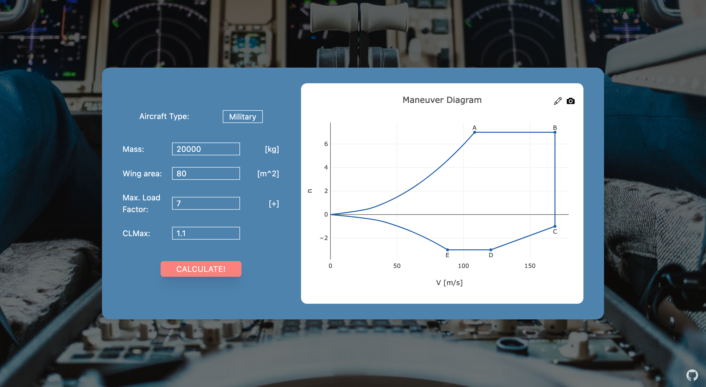
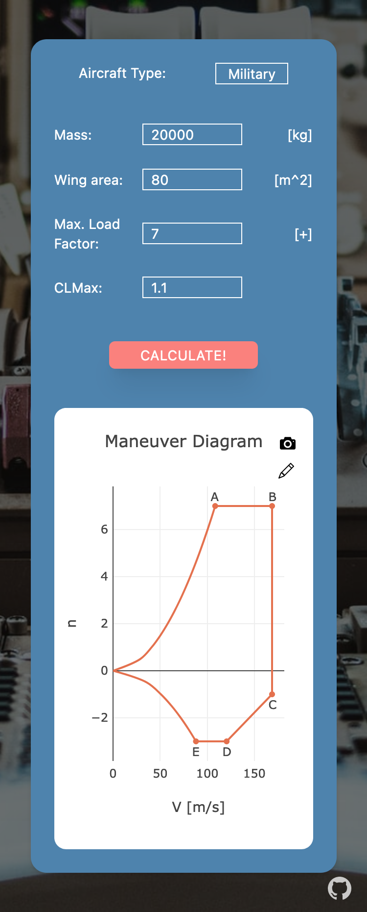

# Flight Envelope

This is a web app that aims to help students and engineers by plotting the flight envelope for a military or civil aircaft.

### Screenshots

### Website

- [Live Site](https://airdgo.github.io/flight-envelope/)

### Built with

- ReactJS
- Tailwind CSS
- Plotly
